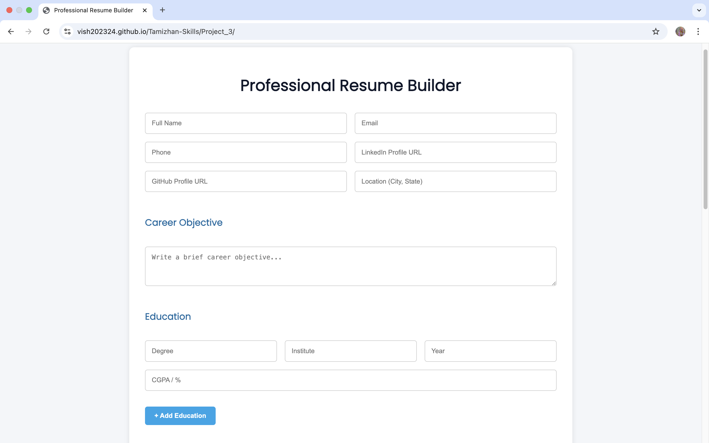

# 🧾 Resume Builder – RISE Internship Project 3

This is a professional-level Resume Builder web app built as part of the RISE Internship program. It allows users to input detailed career information and export a fully formatted resume in PDF format with tables and proper layout.

## 🚀 Features

- 👤 Personal Info (Name, Email, Phone, LinkedIn, GitHub, Location)
- 🧠 Career Objective
- 🎓 Education (Multiple entries with CGPA / Percentage)
- 💼 Experience (Multiple entries with role, duration, responsibilities)
- 🧰 Skills (Comma-separated tags)
- 📂 Projects (Title, description, link)
- 🏅 Certifications (Name, Authority, Year)
- 📄 PDF Export using jsPDF + AutoTable
- 💻 Responsive UI (CSS Flexbox)
- 🔄 Dynamic Field Addition

## 📸 Screenshot

## 🔗 Live Demo

[Click to View](https://vish202324.github.io/Tamizhan-Skills/Project_3/)

## 📁 Folder Structure

resume-builder/
├── index.html
├── style.css
├── script.js
├── assets/
│ └── Screenshot.png

## 💡 Tech Stack

- HTML5 + CSS3
- JavaScript (ES6)
- jsPDF & jsPDF-AutoTable
- Google Fonts (Poppins)

**Vivek Sharma**  
📧 meetviveksharma198@gmail.com  
🔗 [GitHub](https://github.com/vish202324)

## 📜 License

Created under the [Tamizhan Skills – RISE Internship Program](https://tamizhanskills.in/).  
For educational and portfolio purposes only.
