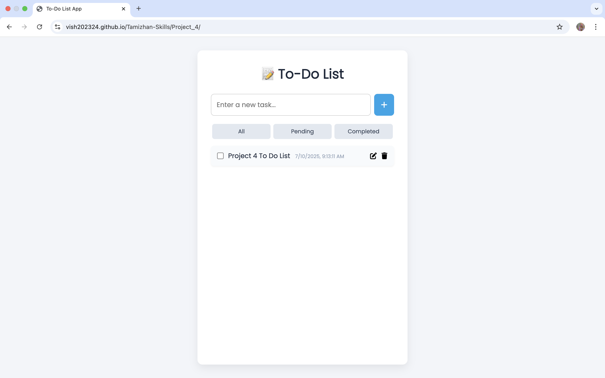

# ✅ To-Do List Web App – RISE Internship Project 4

A responsive and clean productivity app that helps users manage tasks effectively. Users can add, edit, delete, and complete tasks, with persistent data stored using localStorage.

## 🚀 Features

- 🆕 Add new task
- ✏️ Edit existing task
- ✅ Mark task as complete
- 🗑 Delete task
- 🗂 Filter tasks: All / Completed / Pending
- 💾 Save tasks in browser using `localStorage`
- 🕒 Timestamp on every task
- 📱 Fully responsive design
- 🎨 Clean and modern UI with Font Awesome icons
- ⌨️ Add task with Enter key shortcut

## 📸 Preview

## 🔗 Live Demo

[Click to View](https://vish202324.github.io/Tamizhan-Skills/Project_4/)

## 🛠 Tech Stack

- HTML5
- CSS3
- JavaScript (ES6)
- Font Awesome (for icons)
- LocalStorage API

## 📁 Folder Structure

Project_4/
├── index.html
├── style.css
├── script.js
├── assets/
│ └── Screenshot.png

## 🙋‍♂️ Author

**Vivek Sharma**  
📍 Sirsaganj, Uttar Pradesh  
📧 meetviveksharma198@gmail.com

## 📜 License

This project is created for educational purposes under the [Tamizhan Skills RISE Internship](https://tamizhanskills.in/).
