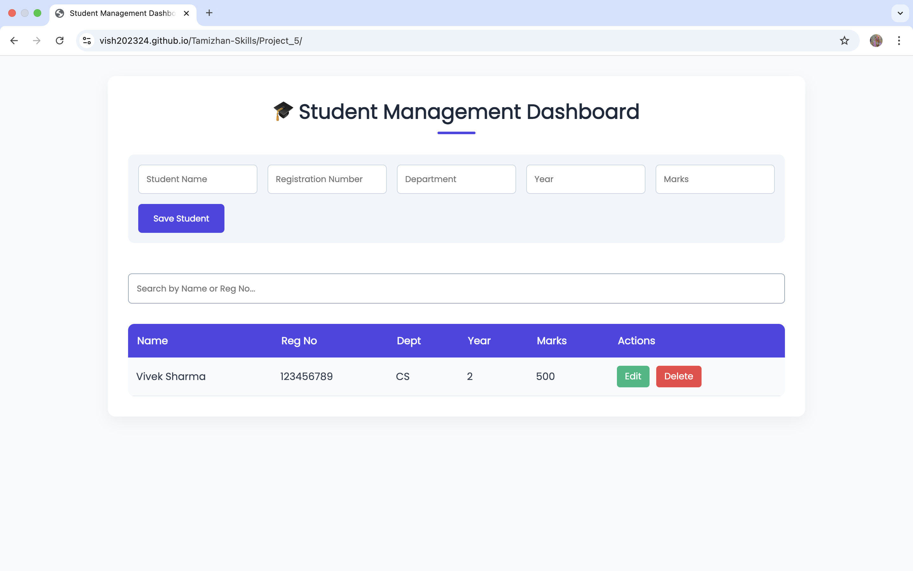

# 🎓 Student Management Dashboard – RISE Internship Project 5

A fully functional, responsive web-based dashboard to manage student records — including add, view, update, delete, and search. Built using HTML, CSS, and JavaScript with `localStorage` support.

## 🚀 Features

- 🆕 Add Student Record
- 📝 Edit/Update Student Info
- 🗑 Delete Record with Confirmation
- 🔍 Live Search by Name or Reg. No
- 💾 LocalStorage Persistence
- 📋 Table View with Clean UI
- 📱 Responsive & User-Friendly Layout
- 🎨 Custom Dashboard-Style Theme (Purple Accent)

## 🖼 Screenshot

_Replace with your own image in `assets/` folder._

## 🔗 Live Demo

[Click to View](https://vish202324.github.io/Tamizhan-Skills/Project_5/)

## 🛠 Tech Stack

- HTML5
- CSS3 (Responsive Grid + Flexbox)
- JavaScript (ES6)
- LocalStorage API

## 📁 Folder Structure

Project_5/
├── index.html
├── style.css
├── script.js
├── assets/
│ └── Screenshot.png

## 🙋‍♂️ Author

**Vivek Sharma**  
📍 Sirsaganj, Uttar Pradesh  
📧 meetviveksharma198@gmail.com

## 📜 License

This project was developed as part of the [Tamizhan Skills RISE Internship](https://tamizhanskills.in/), purely for educational use.

---
